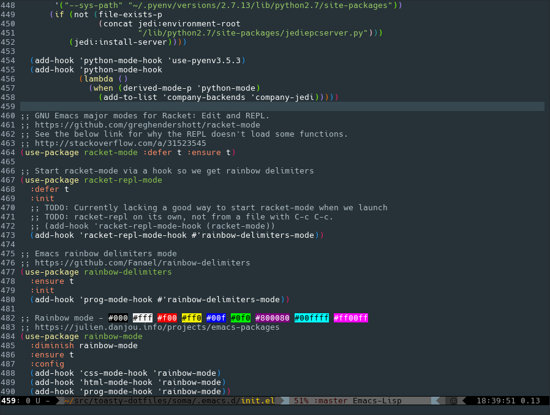

# /home/hristos/.emacs.d/



## About

My Emacs configuration.  I use it on Emacs 25.1+, but it should run fine on Emacs 24 (with some warnings.)  It sports the [Material Theme for Emacs](https://github.com/cpaulik/emacs-material-theme) and [Smart Mode Line](https://github.com/Malabarba/smart-mode-line) with the Respectful theme.  I recommend running this configuration in daemon mode - it's great for GUI Emacs or terminal Emacs.

The main file will set you up with a pretty solid editor for several languages (C/C++, Common Lisp, Lua, Python, Racket, Ruby, YAML, and more) and even some frameworks and other things (Magit, Ansible, Django (via `web-mode`), Nginx, `skewer-mode`,  and others).

## Installation

Copy all `.el` files from the root of this repository into your `~/.emacs.d`, start Emacs.  It may be wise to `mv` your current `~/.emacs.d` out of the way and start fresh.

Two install methods are demonstrated below:

```
# Put it right in place:
mv -v ~/.emacs.d ~/$(date +%F)-emacs.d
git clone https://git.sr.ht/~hristoast/dot-emacs ~/.emacs.d

# Make symlinks
mv -v ~/.emacs.d ~/$(date +%F)-emacs.d
mkdir ~/.emacs.d
git clone https://git.sr.ht/~hristoast/dot-emacs ~/src/hristoast-dot-emacs
ln -sv ~/src/hristoast-dot-emacs/*.el ~/.emacs.d/
```

If you're an Emacs daemon user, your first run should not be in daemon mode so that you can accept the theme (if you choose to use that).  After completing the first successful startup, where all packages and etc are installed, you may start the daemon.

## Usage

All features are broken into separate library files that can be selectively not loaded via the usage of environment variables:

    EMACS_NO_C_CPP=t EMACS_NO_JAVA=t EMACS_NO_RUST=t /usr/bin/emacs

The above example runs this configuration without any extra support for C/C++, Java, and Rust.  A full list of usable variables is below.

### Packages

Set any of the below environment variables to disable the corresponding packages.

Env Var | Description
------- |------------
`EMACS_NO_ANSIBLE` | Packages: company-ansible
`EMACS_NO_C_CPP` | Packages: cc-mode, clang-format, cmake-mode, company-c-headers, company-irony, company-rtags, flycheck-irony, flycheck-rtags, function-args, irony, irony-eldoc
`EMACS_NO_CLOJURE` | Packages: cider, clojure-snippets
`EMACS_NO_CSS` | Packages: css-mode
`EMACS_NO_DOCKER` | Packages: dockerfile-mode
`EMACS_NO_EPL` | Packages: epl
`EMACS_NO_FISH` | Packages: fish-mode
`EMACS_NO_GIT` | Packages: gitignore-mode, magit
`EMACS_NO_GODOT` | Packages: gdscript-mode
`EMACS_NO_GOLANG` | Packages: company-go, go-mode, go-eldoc
`EMACS_NO_GROOVY` | Packages: groovy-mode
`EMACS_NO_HTML` | Packages: html-mode, skewer-mode, web-mode
`EMACS_NO_JAVA` | Packages: meghanada
`EMACS_NO_JAVASCRIPT` | Packages: company-tern, tern
`EMACS_NO_JINJA2` | Packages: jinja2-mode
`EMACS_NO_JSON` | Packages: json-mode
`EMACS_NO_LUA` | Packages: company-lua, lua-mode
`EMACS_NO_MARKDOWN` | Packages: markdown-mode, markdown-mode+
`EMACS_NO_NGINX` | Packages: nginx-mode
`EMACS_NO_ORGMODE` | Packages: org-plus-contrib
`EMACS_NO_PYTHON` | Packages: blacken, company-jedi, pydoc, python-mode
`EMACS_NO_RACKET` | Packages: racket-mode, racket-repl-mode
`EMACS_NO_RUBY` | Packages: robe, ruby-mode
`EMACS_NO_RUST` | Packages: company-racer, flycheck-rust, racer
`EMACS_NO_SHADERS` | Packages: glsl-mode
`EMACS_NO_SLIME` | Packages: slime-company, slime
`EMACS_NO_SYSTEMD` | Packages: systemd
`EMACS_NO_TERRAFORM` | Packages: company-terraform, terraform-mode
`EMACS_NO_TOML` | Packages: toml-mode
`EMACS_NO_YAML` | Packages: yaml-mode

### Tweaks

Set any of the below environment variables to disable the corresponding extra tweaks.

Env Var | Description
------- |------------
`EMACS_NO_EDITING_TWEAKS` | Packages: autorevert, clean-aindent-mode, company, counsel, dtrt-indent, flycheck, ido, rainbow-delimiters, rainbow-mode, semantic, smartparens, swiper), undo-tree, windmove, ws-butler, yasnippet, zygospore
`EMACS_NO_EXTRA_FUNCTIONS` | Extra convenience functions.
`EMACS_NO_INTERNALS_TWEAKS` | Tweaks to various Emacs internals.
`EMACS_NO_KEYBINDINGS_TWEAKS` | Custom keybindings that are not necessarily mode-specific.
`EMACS_NO_UI_TWEAKS` | Packages: diff-hl, fireplace, flycheck-status-emoji, smart-mode-line, material-theme

### Package-Specific Variables

These variables are for specific packages.

Env Var | Description
------- |------------
`EMACS_NO_DIFF_HL` | Don't use diff-hl.
`EMACS_NO_FIREPLACE` | Don't allow Emacs to be a warm cozy fireplace.
`EMACS_NO_GOPATH` | Disable setting GOPATH in this config.
`EMACS_NO_GOBINPATH` | Don't try to add a custom bin dir to `exec-path`.
`EMACS_NO_GOCODE` | Don't try to set up `gocode`
`EMACS_NO_STATUS_EMOJII` | Don't use emojii for Flycheck's status.
`EMACS_NO_SMART_MODE_LINE` | Don't use smart-mode-line.
`EMACS_NO_THEME` | Don't load a theme.

## Installation Requirements

For language-specific support to fully work, you need to have some related packages installed:

### C/C++

For the best completion support for C/C++ (via irony), the below packages are needed:

    clang llvm

Then, after running Emacs you will need to interactively run `irony-install-server` (e.g. `M-x irony-install-server RET`.)

At the moment, this config doesn't have equivalent support for GCC.

### Golang

A working install of a recent `go` version is needed for the included configuration.

### Javascript

To ensure tern works as expected, the `tern` binary must be available on your system and somewhere within `exec-path`.

### Lua

For full lua support via Flycheck, ensure you've got [luackeck](https://github.com/mpeterv/luacheck) on your system and somewhere within `exec-path`.

### Python

The below packages are needed for full python3 support:

    python3 python3-flake8 python3-pip python3-jedi python3-virtualenv

Your distribution or operating system may name them differently.  Python 2 support requires equivalent packages for that version.

## Issues

* As noted above, this configuration needs to be ran with non-daemon Emacs first.
* Additionally, the very first run will fail with an error regarding `ensure-system-package`.  Re-running Emacs will continue the setup as intended.
* This configuration works best with GUI Emacs.  It tries to behave well when used in terminal Emacs (and should be fine on a GNU/Linux system), but there may be issues with some keybindings on macOS.
